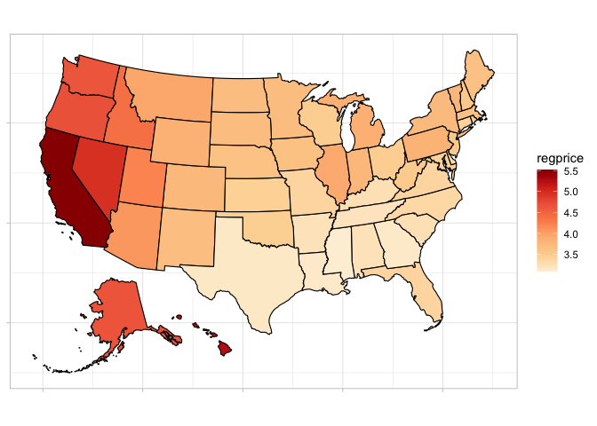

README
================

## Quick heatmaps from scraped data.

Shout out to Quang for showing me how. This is a relatively easy way to
visualize something across the country, such as gas prices.

### Get url of data source you want to scrape

``` r
library(tidyverse)
library(rvest)
library(ggthemes)
library(usmap)

dat_url <- "https://gasprices.aaa.com/state-gas-price-averages/"
```

### Identify the element you want to use

This is the tricky part, but you can inspect element on the web page to
identify the xpath. In this case it is a table.

``` r
gasdata <- dat_url %>% 
  read_html() %>% 
  html_element(xpath = '//*[@id="sortable"]') %>%
  html_table()
```

### Some minor data cleaning

``` r
gasdata <- gasdata %>% 
  mutate(regprice = as.numeric(str_remove(Regular, "\\$"))) %>% 
  rename(state = State)
```

### Making the Viz

The plot_usmap package requires the regions argument to have specific
names

``` r
plot_usmap(regions = "state",
           values = "regprice",
           data = gasdata) +
  theme_light() +
  scale_fill_distiller(palette = "OrRd",
                       direction = 1) +
  theme(axis.text = element_blank(),
        axis.title = element_blank())
```

<!-- -->

There you have it. All in just a few minutes.
